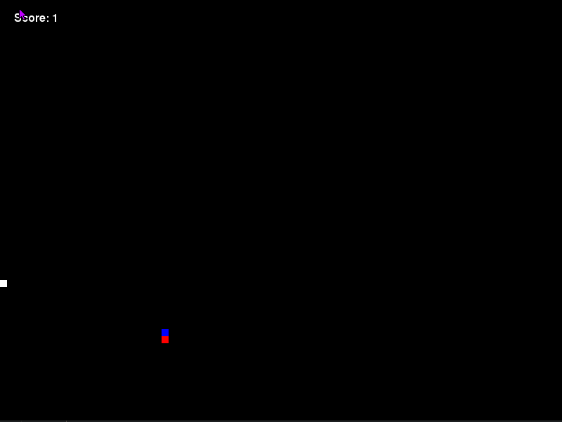

# Snake Game
Basic snake game created with python3 and Pygame

# Screenshots


# How to run
- Create a virtual environment and activate it
```
# Windows
py -m venv .env
\.env\Scripts\activate

# Unix
python3 -m venv .env
source .env/bin/activate

```
- Install the necessary packages
```
pip install -r requirements.txt
```

- Run the program
```
python snake.py
```